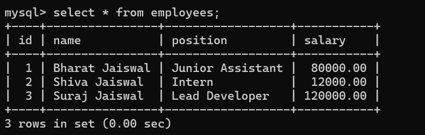

# Java JDBC Employee Database App


A simple yet robust console-based Java application for managing an employee database. This project demonstrates core Java Database Connectivity (JDBC) principles by implementing complete CRUD (Create, Read, Update, Delete) functionality.

The primary goal is to master foundational database interaction in Java without the use of higher-level abstraction frameworks like Hibernate or JPA.

## Features

-   **Add a new employee:** Persist a new employee's details (name, position, salary) to the database.
-   **View all employees:** Retrieve and display a list of all employees from the database.
-   **Update an employee:** Modify the details of an existing employee by their ID.
-   **Delete an employee:** Remove an employee's record from the database using their ID.
-   **Clean Architecture:** Separates database connection logic, data access logic (DAO), and the main application logic.
-   **Error Handling:** Implements basic error handling for database exceptions and invalid user input.

## Tech Stack

-   **Language:** Java (JDK 11+)
-   **Build Tool:** Apache Maven
-   **Database Connectivity:** Java Database Connectivity (JDBC) API
-   **Databases Supported:** MySQL, PostgreSQL
-   **IDE:** intellij IDEA/VS Code

## Prerequisites

Before you begin, ensure you have the following installed on your system:

-   **Java Development Kit (JDK):** Version 11 or higher.
-   **Apache Maven:** To manage dependencies and build the project.
-   **Database Server:**
    -   MySQL Server OR
    -   PostgreSQL Server

## Setup and Installation

Follow these steps to get the application running on your local machine.

### 1. Clone the Repository

```bash
git clone https://github.com/bharatjaiswal856/employee-db-app.git
cd employee-db-app
```

### 2. Database Setup

You must create the database and the `employees` table before running the application. Connect to your database server using a client like MySQL Workbench, pgAdmin, or the command line and execute the appropriate script below.

**For MySQL:**

```sql
CREATE DATABASE employee_db;
USE employee_db;

CREATE TABLE employees (
    id INT AUTO_INCREMENT PRIMARY KEY,
    name VARCHAR(100) NOT NULL,
    position VARCHAR(100),
    salary DECIMAL(10, 2)
);
```

**For PostgreSQL:**

```sql
CREATE DATABASE employee_db;
-- Connect to the new database before running the next command
CREATE TABLE employees (
    id SERIAL PRIMARY KEY,
    name VARCHAR(100) NOT NULL,
    position VARCHAR(100),
    salary NUMERIC(10, 2)
);
```

### 3. Configure Application Properties

#### a. Database Connection

Open the `src/main/java/com/mycompany/DatabaseConnector.java` file and update the database URL, user, and password to match your local setup.

```java
public class DatabaseConnector {
    // --- CONFIGURE YOUR DATABASE CONNECTION HERE --- //
    private static final String USER = "your_db_user";     // <-- CHANGE THIS
    private static final String PASS = "your_db_password"; // <-- CHANGE THIS

    // --- UNCOMMENT THE URL FOR THE DATABASE YOU ARE USING --- //
    // For MySQL
    private static final String DB_URL = "jdbc:mysql://localhost:3306/employee_db";

    // For PostgreSQL
    // private static final String DB_URL = "jdbc:postgresql://localhost:5432/employee_db";
    
    // ... rest of the file
}
```

#### b. Maven Dependencies

Open the `pom.xml` file and ensure the correct JDBC driver dependency is uncommented for the database you are using.

```xml
<!-- 1. MySQL JDBC Driver -->
<dependency>
    <groupId>com.mysql</groupId>
    <artifactId>mysql-connector-j</artifactId>
    <version>8.0.33</version>
</dependency>

<!-- 2. PostgreSQL JDBC Driver -->
<!--
<dependency>
    <groupId>org.postgresql</groupId>
    <artifactId>postgresql</artifactId>
    <version>42.7.1</version>
</dependency>
-->
```

### 4. Build the Project

Use Maven to compile the project and download all necessary dependencies.

```bash
mvn clean install
```

## Running the Application

You can run the application in two ways:

#### 1. From your IDE (e.g., VS Code)

-   Open the `MainApp.java` file.
-   Click the "Run" button that appears above the `main` method.

#### 2. From the Command Line

Execute the following Maven command from the project's root directory.

```bash
mvn exec:java "-Dexec.mainClass=com.mycompany.MainApp"
```

## Example Usage

Once the application is running, you will see a menu in the console.

```
--- Employee Database Menu ---
1. Add a new Employee
2. View all Employees
3. Update an Employee
4. Delete an Employee
5. Exit
Enter your choice: 1
Enter name: Suraj Jaiswal
Enter position: Lead Developer
Enter salary: 120000
==> Employee added successfully!

--- Employee Database Menu ---
1. Add a new Employee
2. View all Employees
3. Update an Employee
4. Delete an Employee
5. Exit
Enter your choice: 2

--- All Employees ---
Employee [ID=1, Name=Bharat Jaiswal, Position=Junior Assistant, Salary=80000.00]
Employee [ID=2, Name=Shiva Jaiswal, Position=Intern , Salary=12000.00]
Employee [ID=3, Name=Suraj Jaiswal, Position=Lead Developer, Salary=120000.00]

--- Employee Database Menu ---
1. Add a new Employee
2. View all Employees
3. Update an Employee
4. Delete an Employee
5. Exit
Enter your choice: 5
Exiting application.

```

## Database Screenshot

Here is a look at the employees table in database.



## Project Structure

The project follows the standard Maven directory layout.

```
employee-db-app/
├── pom.xml
└── src/
    └── main/
        └── java/
            └── com/
                └── mycompany/
                    ├── DatabaseConnector.java  # Handles DB connection
                    ├── Employee.java           # Model (POJO)
                    ├── EmployeeDAO.java        # Data Access Object (CRUD logic)
                    └── MainApp.java            # Main application entry point
```

### Author

* [Bharat Jaiswal](https://github.com/bharatjaiswal856/employee-db-app)

-----